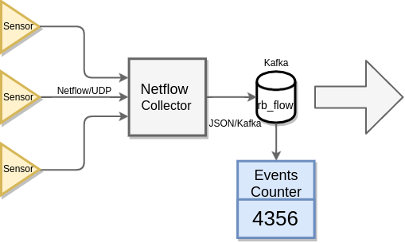
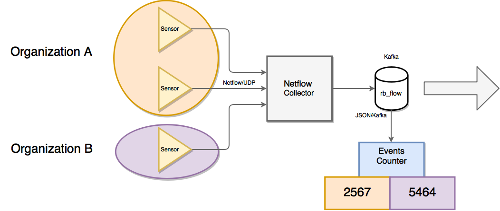

# Licencias Demo

> http://licenses.redborder.com

- [Repositorio](https://github.com/redBorder/license-generator)
- [Documentación](https://redborder.github.io/license-generator)

---

### Características

- Permite la creación de licencias demo (válidas por 30 días desde su generación).
- Sólo se permite una licencia por _cluster_.
- Se pueden generar licencias para entornos con o sin licenciamiento por
organizaciones.

---?gist=e29070e29d77ac599d19d31759eadc92

### Ejemplo de licencia demo

+++

### Petición de licencia

```
POST /api/v1/licenses
Content-Type: application/json

{
  "cluster_uuid": "my cluster uuid",
  "organization_uuid": "my organization uuid"
}
```

> [Demo interactiva](http://crunner.redborder.lan:3030)

---

# Conteo de eventos por organizaciones

---

### Nueva funcionalidad para el servicio que realiza el conteo de eventos

> Conteo de mensajes por organizaciones

+++

### Funcionamiento sin conteo por organización

- **Todos** los mensajes se cuentan globalmente
- Se cargan las licencias globales
- Se ignoran las licencias de organización

+++



+++

### Funcionamiento con conteo por oganización

- Hay una cuenta por cada organización
- Los mensajes sin organización son ignorados
- Los mensajes con organización cuentan sólo para su organización
- Se cargan las licencias por organización
- Se ignoran las licencias globales

+++


